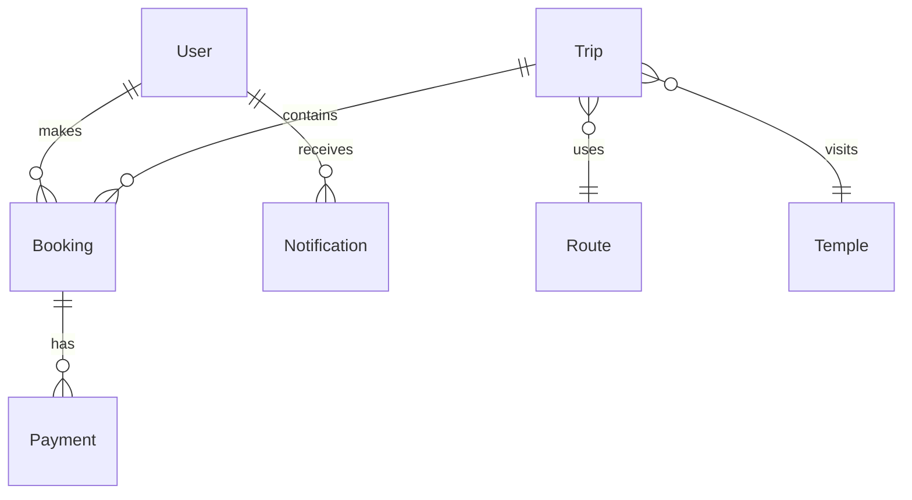

# 🚌 WeekendDarshan

### *Weekend Travel & Temple Darshan Booking Platform*

[](https://opensource.org/licenses/MIT)
[](https://nextjs.org/)
[](https://www.typescriptlang.org/)
[](https://tailwindcss.com/)

A comprehensive weekend travel and temple darshan booking platform that makes spiritual journeys accessible and comfortable for everyone.

---

## 🎯 Core Purpose

To allow users to **easily discover, book, and travel** on **weekend religious trips** (starting with **Delhi → Khatu Shyam ji**) with **simple booking, transparent pricing, and smooth coordination**.

---

## ✨ Features Implemented

### 👥 User-Side Features
- ✅ **User Authentication**: Mobile/OTP-based login system
- ✅ **Trip Discovery**: Browse upcoming weekend trips with detailed information
- ✅ **Trip Details**: Comprehensive trip information with inclusions, exclusions, and policies
- ✅ **Seat Booking**: Multi-passenger booking with detailed passenger information
- ✅ **Payment System**: Secure payment integration with UPI/Card support
- ✅ **Digital Tickets**: QR code-based booking confirmation and tickets
- ✅ **My Bookings**: View and manage all bookings with search functionality
- ✅ **Notifications**: Real-time updates and alerts
- ✅ **Responsive Design**: Mobile-first design that works on all devices

### 🧑‍💼 Admin Panel Features
- ✅ **Admin Authentication**: Secure admin login system
- ✅ **Dashboard**: Overview of trips, bookings, and revenue
- ✅ **Trip Management**: Full CRUD operations for trips
- ✅ **Booking Management**: View, manage, and cancel bookings
- ✅ **Reports & Analytics**: Comprehensive reports with CSV export
- ✅ **Real-time Statistics**: Track revenue, occupancy, and performance
- ✅ **Payment Management**: Confirm payments and process refunds
- ✅ **Customer Management**: View customer details and booking history

---

## 🛠️ Technology Stack

### Core Framework
- **⚡ Next.js 16** - React framework with App Router
- **📘 TypeScript 5** - Type-safe development
- **🎨 Tailwind CSS 4** - Utility-first styling
- **🧩 shadcn/ui** - High-quality UI components

### Database & Backend
- **🗄️ Prisma** - Modern TypeScript ORM
- **💾 SQLite** - Lightweight database for development
- **🔐 NextAuth.js** - Authentication system (ready for implementation)

### UI/UX
- **🎯 Lucide React** - Beautiful icons
- **🌈 Framer Motion** - Smooth animations
- **📱 Responsive Design** - Mobile-first approach

---

## 🚀 Quick Start

### Prerequisites
- Node.js 18+ and npm/yarn/bun
- Git

### Installation

```bash
# Clone the repository
git clone https://github.com/jitenkr2030/Weekend-Darshan.git
cd Weekend-Darshan

# Install dependencies
bun install

# Set up environment variables
cp .env.example .env.local
# Edit .env.local with your configuration

# Set up database
bun run db:push

# Seed sample data (optional but recommended)
bun run seed.ts

# Start development server
bun run dev
```

Open [http://localhost:3000](http://localhost:3000) to view the application.

### Environment Variables

Create a `.env.local` file in the root directory:

```env
# Database
DATABASE_URL="file:./dev.db"

# NextAuth.js (for future implementation)
NEXTAUTH_URL="http://localhost:3000"
NEXTAUTH_SECRET="your-secret-key"

# Payment Gateway (for production)
RAZORPAY_KEY_ID="your-razorpay-key"
RAZORPAY_KEY_SECRET="your-razorpay-secret"
```

---

## 📁 Project Structure

```
src/
├── app/                          # Next.js App Router
│   ├── admin/                   # Admin panel
│   │   ├── login/              # Admin login
│   │   └── dashboard/          # Admin dashboard
│   ├── api/                    # API routes
│   │   ├── trips/              # Trip management APIs
│   │   ├── bookings/           # Booking APIs
│   │   └── payments/           # Payment APIs
│   ├── book/[tripId]/          # Booking flow
│   ├── my-bookings/            # User bookings
│   ├── payment/[bookingId]/    # Payment processing
│   ├── ticket/[bookingId]/     # Digital tickets
│   ├── trip/[id]/              # Trip details
│   └── page.tsx                # Homepage
├── components/
│   ├── ui/                     # shadcn/ui components
│   └── trip-card.tsx           # Custom trip card component
├── types/
│   └── index.ts                # TypeScript type definitions
└── lib/
    ├── db.ts                   # Prisma client
    └── utils.ts                # Utility functions
```

---

## 🗄️ Database Schema

The application uses a comprehensive database schema with the following models:

- **Users** - User accounts and authentication
- **Temples** - Temple destinations and information
- **Routes** - Bus routes between cities
- **Trips** - Scheduled trips with dates and pricing
- **Bookings** - User bookings and passenger details
- **Payments** - Payment records and transactions
- **Notifications** - User notifications and alerts
- **Settings** - Admin configuration settings

### Database Diagram



---

## 🎯 Key Features

### Trip Discovery
- Browse upcoming weekend trips
- Filter by destination and date
- Real-time seat availability
- Transparent pricing with advance options

### Booking Flow
- Multi-passenger booking (up to 6 seats)
- Detailed passenger information collection
- Multiple boarding point selection
- Secure payment processing

### Digital Tickets
- QR code-based verification
- Comprehensive booking details
- Download and sharing options
- Emergency contact information

### Admin Dashboard
- Real-time statistics and analytics
- Trip and booking management
- Revenue tracking
- User support tools

---

## 🔐 Admin Access

For demonstration purposes, use these credentials:
- **Email**: admin@weekenddarshan.com
- **Password**: admin123

Access the admin panel at `/admin/login`

---

## 🌟 Sample Data

The application includes sample data for:
- **Temples**: Khatu Shyam Ji, Salasar Balaji
- **Routes**: Delhi to various temple destinations
- **Trips**: Weekend trips with realistic schedules and pricing
- **Bookings**: Sample booking data for testing

Run `bun run seed.ts` to populate the database with sample data.

---

## 📱 Mobile Responsiveness

The application is fully responsive and optimized for:
- 📱 Mobile phones (320px+)
- 📟 Tablets (768px+)
- 💻 Desktops (1024px+)

---

## 🚀 Production Features

- **SEO Optimized**: Meta tags and structured data
- **Performance**: Optimized images and lazy loading
- **Accessibility**: WCAG compliant components
- **Security**: Input validation and XSS protection
- **Error Handling**: Comprehensive error boundaries

---

## 📸 Screenshots

### Homepage


### Trip Details


### Booking Flow


### Admin Dashboard


---

## 🤝 Future Enhancements

### Planned Features
- 📱 **Mobile App**: React Native companion app
- 🔔 **WhatsApp Integration**: Automated notifications
- 📊 **Advanced Analytics**: Google Analytics integration
- 🎟️ **QR Code Scanning**: Mobile boarding passes
- 📍 **Live Tracking**: Real-time bus location
- 💳 **Multiple Payment Gateways**: PhonePe, GPay, Paytm
- 🌍 **Multi-language**: Hindi and regional languages
- ⭐ **Reviews & Ratings**: User feedback system

### Advanced Admin Features
- 📈 **Advanced Reports**: Excel/CSV exports
- 👥 **Agent Management**: Multi-agent support
- 🎫 **Ticket Templates**: Customizable ticket designs
- 📢 **Broadcast Messages**: Bulk notifications
- 🔧 **Settings Management**: Dynamic configuration

---

## 🛠️ Development

### Available Scripts

```bash
# Development
bun run dev          # Start development server
bun run build        # Build for production
bun run start        # Start production server
bun run lint         # Run ESLint

# Database
bun run db:push      # Push database schema
bun run db:generate  # Generate Prisma client
bun run db:migrate   # Run database migrations
bun run db:reset     # Reset database

# Testing (to be added)
bun run test         # Run tests
bun run test:watch   # Run tests in watch mode
```

### Code Quality

- **ESLint**: Code linting and formatting
- **TypeScript**: Type safety
- **Prettier**: Code formatting (configured)
- **Husky**: Git hooks (to be added)

---

## 📊 API Documentation

### Trips API
- `GET /api/trips` - Get all trips
- `GET /api/trips/[id]` - Get specific trip

### Bookings API
- `GET /api/bookings` - Get all bookings
- `POST /api/bookings` - Create new booking
- `GET /api/bookings/[id]` - Get specific booking
- `GET /api/bookings/search` - Search bookings

### Payments API
- `POST /api/payments` - Process payment

---

## 🚀 Deployment

### Vercel (Recommended)
```bash
# Install Vercel CLI
npm i -g vercel

# Deploy
vercel
```

### Docker
```bash
# Build Docker image
docker build -t weekend-darshan .

# Run container
docker run -p 3000:3000 weekend-darshan
```

### Traditional Hosting
```bash
# Build for production
bun run build

# Start production server
bun start
```

---

## 🤝 Contributing

1. Fork the repository
2. Create a feature branch (`git checkout -b feature/amazing-feature`)
3. Commit your changes (`git commit -m 'Add some amazing feature'`)
4. Push to the branch (`git push origin feature/amazing-feature`)
5. Open a Pull Request

### Development Guidelines
- Follow the existing code style
- Write TypeScript for all new code
- Add comments for complex logic
- Update documentation for new features
- Test your changes thoroughly

---

## 📞 Support & Contact

- **Phone**: +91-9876543210
- **WhatsApp**: +91-9876543210
- **Email**: info@weekenddarshan.com
- **GitHub Issues**: [Create an issue](https://github.com/jitenkr2030/Weekend-Darshan/issues)
- **24/7 Support**: Available for all passengers

---

## 📄 License

This project is licensed under the MIT License - see the [LICENSE](LICENSE) file for details.

---

## 🙏 Acknowledgments

Built with devotion for the spiritual community. Making temple darshan accessible to everyone with comfort and convenience.

### Special Thanks
- [Next.js](https://nextjs.org/) - The React framework
- [Tailwind CSS](https://tailwindcss.com/) - Utility-first CSS framework
- [shadcn/ui](https://ui.shadcn.com/) - Beautiful UI components
- [Prisma](https://www.prisma.io/) - Modern database toolkit
- [Lucide](https://lucide.dev/) - Beautiful icons

---

## 📈 Project Stats


---

*🚌 WeekendDarshan - Your Spiritual Journey, Simplified*
